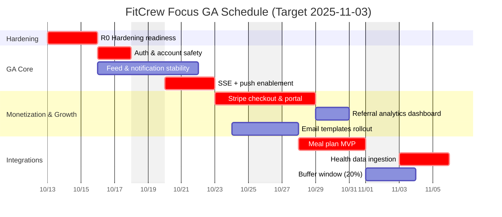

# FitCrew Focus GA Schedule

Assumption: Start 2025-10-13, GA target 2025-11-03. Critical path workload is 18 days with a 20% buffer scheduled 2025-11-01 → 2025-11-02.

- R0 establishes a green build and observability foundations before feature work begins.
- R1 overlaps feed hardening with SSE rollout; QA shadows nightly regressions once SSE stabilises.
- R2 runs Stripe monetisation on the critical path while growth analytics executes in parallel once webhook processing lands.
- R3 finalises meal plans and health integrations, with the buffer reserved for perf, security, and release rehearsal leading into GA.
